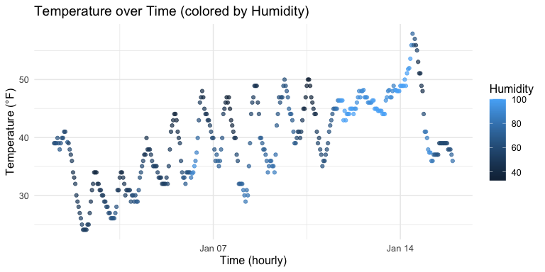

P8105 HW1 – mk4992
================
Maryam Khalid

- [Problem 1](#problem-1)
- [Problem 2](#problem-2)

## Problem 1

``` r
library(moderndive)  
library(ggplot2)     
```

``` r
data("early_january_weather")
```

**Data Summary** Rows: 358  
Columns: 15  
Mean temperature: 39.6 °F

Key variables (see help in Console with
`?early_january_weather`):`time_hour` (date-time), `temp` (°F), `humid`
(0–100), `dewp`, `wind_dir`, `wind_speed`, `visib`, `pressure`, etc.

**Scatterplot: temp(y) vs time_hour(x); colored by humidity**

``` r
p_temp_time <- ggplot(early_january_weather,
                      aes(x = time_hour, y = temp, color = humid)) +
  geom_point(alpha = 0.7, size = 1.5, na.rm = TRUE) +
  scale_color_continuous(name = "Humidity") +
  labs(
    title = "Temperature over Time (colored by Humidity)",
    x = "Time (hourly)",
    y = "Temperature (°F)"
  ) +
  theme_minimal(base_size = 12)

p_temp_time
```

<!-- -->

**Note:** The temperature fluctuates daily from day to night. In
addition, when the temperature is higher, the humidity is typically
increased as well.

``` r
ggsave("temp_vs_time_humid_scatter.png", p_temp_time, width = 8, height = 4, dpi = 300)
```

``` r
sessionInfo()
```

    ## R version 4.5.1 (2025-06-13)
    ## Platform: aarch64-apple-darwin20
    ## Running under: macOS Sonoma 14.2.1
    ## 
    ## Matrix products: default
    ## BLAS:   /Library/Frameworks/R.framework/Versions/4.5-arm64/Resources/lib/libRblas.0.dylib 
    ## LAPACK: /Library/Frameworks/R.framework/Versions/4.5-arm64/Resources/lib/libRlapack.dylib;  LAPACK version 3.12.1
    ## 
    ## locale:
    ## [1] en_US.UTF-8/en_US.UTF-8/en_US.UTF-8/C/en_US.UTF-8/en_US.UTF-8
    ## 
    ## time zone: America/New_York
    ## tzcode source: internal
    ## 
    ## attached base packages:
    ## [1] stats     graphics  grDevices utils     datasets  methods   base     
    ## 
    ## other attached packages:
    ## [1] ggplot2_3.5.2    moderndive_0.7.0
    ## 
    ## loaded via a namespace (and not attached):
    ##  [1] gtable_0.3.6         dplyr_1.1.4          compiler_4.5.1      
    ##  [4] tidyselect_1.2.1     stringr_1.5.1        snakecase_0.11.1    
    ##  [7] tidyr_1.3.1          textshaping_1.0.3    systemfonts_1.2.3   
    ## [10] scales_1.4.0         yaml_2.3.10          fastmap_1.2.0       
    ## [13] R6_2.6.1             labeling_0.4.3       generics_0.1.4      
    ## [16] infer_1.0.9          knitr_1.50           operator.tools_1.6.3
    ## [19] backports_1.5.0      tibble_3.3.0         janitor_2.2.1       
    ## [22] lubridate_1.9.4      pillar_1.11.0        RColorBrewer_1.1-3  
    ## [25] formula.tools_1.7.1  rlang_1.1.6          stringi_1.8.7       
    ## [28] broom_1.0.9          xfun_0.53            timechange_0.3.0    
    ## [31] cli_3.6.5            withr_3.0.2          magrittr_2.0.3      
    ## [34] digest_0.6.37        grid_4.5.1           rstudioapi_0.17.1   
    ## [37] lifecycle_1.0.4      vctrs_0.6.5          evaluate_1.0.5      
    ## [40] glue_1.8.0           farver_2.1.2         ragg_1.5.0          
    ## [43] rmarkdown_2.29       purrr_1.1.0          tools_4.5.1         
    ## [46] pkgconfig_2.0.3      htmltools_0.5.8.1

## Problem 2

``` r
library(dplyr) 
```

``` r
set.seed(8105)

num_vec  <- rnorm(10) # numeric: N(0,1)
log_vec  <- num_vec > 0  # logical: TRUE if > 0
char_vec <- sample(letters, size = 10, replace = TRUE) # character: 10 letters
fac_vec  <- factor(sample(c("low", "med", "high"), size = 10, replace = TRUE), levels = c("low", "med", "high"))  # factor: 3 levels

df <- tibble::tibble(
  num         = num_vec,
  is_positive = log_vec,
  code        = char_vec,
  tier        = fac_vec
)

df
```

    ## # A tibble: 10 × 4
    ##        num is_positive code  tier 
    ##      <dbl> <lgl>       <chr> <fct>
    ##  1  0.674  TRUE        y     med  
    ##  2  1.31   TRUE        a     low  
    ##  3  0.115  TRUE        q     low  
    ##  4  1.07   TRUE        h     med  
    ##  5  0.155  TRUE        w     med  
    ##  6  2.12   TRUE        y     med  
    ##  7 -0.219  FALSE       r     high 
    ##  8 -0.113  FALSE       t     med  
    ##  9 -0.0651 FALSE       a     low  
    ## 10  0.476  TRUE        q     high

**Means that work (numeric & logical):**

``` r
mean_num <- mean(pull(df, num))
mean_log <- mean(pull(df, is_positive))  # TRUE = 1, FALSE = 0 → proportion TRUE

mean_num
```

    ## [1] 0.5520184

``` r
mean_log
```

    ## [1] 0.7

**Means that don’t work (character & factor):**

``` r
mean(pull(df, code))  # character --> NA with warning
```

    ## [1] NA

``` r
mean(pull(df, tier))  # factor --> NA with warning
```

    ## [1] NA

**Coercion with `as.numeric()` (show code, hide output):**

``` r
as_num_log    <- as.numeric(df$is_positive)  # either 0/1
as_num_char   <- as.numeric(df$code)         # NA (non-numeric strings)
as_num_factor <- as.numeric(df$tier)         # integer level codes as 1, 2, and 3

# (Hidden) quick peeks:
head(as_num_log); head(as_num_char); head(as_num_factor)
```

**Explanation**  
- `logical → numeric` becomes **0 or 1**, so `mean(TRUE/FALSE)` is the
arithmetic mean of zeroes and ones.

- `character → numeric` gives **NA** since certain string items like
  letters cannot be converted into numbers. Thus, the mean is undefined.

- `factor → numeric` returns **level codes** (e.g., low=1, med=2,
  high=3) based on how the variable was defined. Thus, a mean can be
  calculated from this conversion but it may not be statistically
  reflective of the datapoints in the categories.
